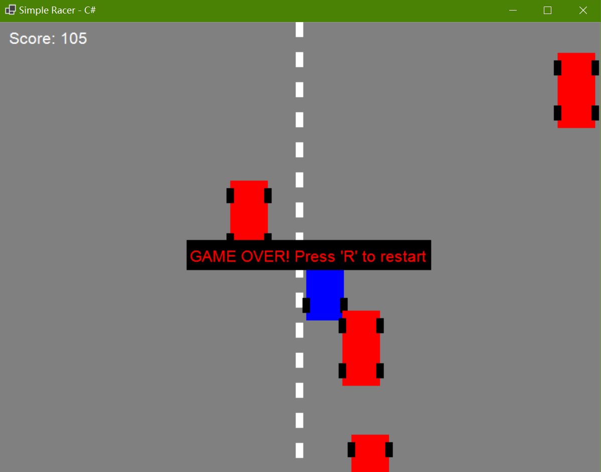

# Simple Racer (File-Based Apps, Python & C#)



## Description
_Simple Racer_ is a simple racing game that can be played in GUI windows. The game is implemented in both Python and C# to demonstrate cross-language game development with identical gameplay mechanics. As a current limitation, both versions have **no pause functionality**.

## Game Features

- **Simple Controls**: Use arrow keys (← → ↑ ↓) to control your blue car
- **Avoid Enemy Cars**: Dodge red enemy cars coming from the top of the screen
- **Score System**: Earn points for each enemy car that safely passes off-screen
- **Collision Detection**: Game ends when your car collides with an enemy
- **Restart Functionality**: Press 'R' to restart after game over
- **Smooth Graphics**: Double-buffered rendering for smooth animation

## Prerequisites

### For Python Version
- Python 3.7 or higher
- Pygame library: `pip install pygame`

### For C# Version
- [.NET 10 SDK](https://dotnet.microsoft.com/download/dotnet/10.0) for file-based execution
- Windows operating system (Windows Forms dependency)
- .NET 6.0 through .NET 9.0 if you prefer older SDKs (see the [Building From Source](#building-from-source) section)

## Quick Start

### Running the Python Version
```bash
python simple_racer.py
```

### Running the C# Version (Modern .NET 10 SDK)
```bash
dotnet run SimpleRacer.cs
```

**Note**: With .NET 10 SDK, you can run C# files directly without a project file!

## Project Structure

```
Simple-Racer-Python-CSharp/
├── simple_racer.py         # Python version using Pygame
├── SimpleRacer.cs          # C# version using Windows Forms
├── README.md               # This file
├── LICENSE                 # MIT License
└── screenshot.png          # Game screenshot
```

## Gameplay Instructions

1. **Start the Game**: Run either the Python or C# version
2. **Control Your Car**: Use arrow keys to move your blue car
   - **Left Arrow**: Move left
   - **Right Arrow**: Move right  
   - **Up Arrow**: Move up
   - **Down Arrow**: Move down
3. **Avoid Red Cars**: Enemy cars will spawn from the top and move downward
4. **Score Points**: Each enemy car that goes off the bottom screen gives you +1 point
5. **Game Over**: Collide with any enemy car to end the game
6. **Restart**: Press 'R' key to restart after game over

## Technical Details

### Python Version (`simple_racer.py`)
- **Framework**: Pygame
- **Graphics**: 800x600 window with real-time rendering
- **Game Loop**: 60 FPS fixed update loop
- **Dependencies**: Only requires Pygame library

### C# Version (`SimpleRacer.cs`)
- **Framework**: Windows Forms with BufferedGraphics
- **Graphics**: 800x600 window with double-buffered rendering
- **Game Loop**: Application.Idle event-based loop
- **Dependencies**: Built-in Windows Forms (no external dependencies)
- **.NET 10 Feature**: Can be run directly with `dotnet run SimpleRacer.cs`

## Development Notes

### Both versions implement:
- **AABB Collision Detection**: Simple rectangle-based collision
- **Delta Time Movement**: Frame-rate independent movement
- **Object-Oriented Design**: Separate `RacingCar` class with move/draw methods
- **Game State Management**: Running, game over, and restart states

### C# Specific Features:
- **File-Based Execution**: No project file required with .NET 10 SDK
- **Windows Forms Integration**: Native Windows GUI components
- **Resource Management**: Proper disposal of graphics resources

## Building from Source
First, clone the repository and navigate into the project directory:
```bash
git clone https://github.com/Pac-Dessert1436/Simple-Racer-Python-CSharp.git
cd Simple-Racer-Python-CSharp
```

### Python Version
```bash
# Install dependencies
pip install pygame

# Run the game
python simple_racer.py
```

### C# Version (Traditional Project Approach)
If you prefer using a project file for older .NET SDKs:

1. Create a new console project:
```bash
dotnet new console -n SimpleRacer
```
2. Replace `Program.cs` with `SimpleRacer.cs`. (_Note that the `#:property` directives should not be included in `SimpleRacer.cs` because they are intended for .NET 10 SDK._)
3. Update the .csproj file to target Windows, using latest language version:
```xml
<Project Sdk="Microsoft.NET.Sdk">
  <PropertyGroup>
    <OutputType>WinExe</OutputType>
    <TargetFramework>net6.0-windows</TargetFramework>
    <UseWindowsForms>true</UseWindowsForms>
    <Nullable>enable</Nullable>
    <ImplicitUsings>enable</ImplicitUsings>
    <LangVersion>latest</LangVersion>
  </PropertyGroup>
</Project>
```
4. Build and run the project:
```bash
dotnet run
```

## Troubleshooting

### Python Version Issues
- **ModuleNotFoundError: No module named 'pygame'**: Install pygame with `pip install pygame`
- **Game runs slowly**: Ensure you have hardware acceleration enabled

### C# Version Issues
- **'dotnet run' doesn't work**: Ensure .NET 6.0+ SDK is installed
- **Windows Forms errors**: Make sure you're on Windows OS
- **File-based execution not working**: Upgrade to .NET 10 SDK for this feature

## License

This project is licensed under the MIT License. See the [LICENSE](LICENSE) file for details.

## Contributing

Feel free to submit issues and enhancement requests! This is a simple educational project demonstrating:
- Cross-language game development
- File-based application execution in .NET 10
- Basic game programming concepts
- GUI application development in both Python and C#